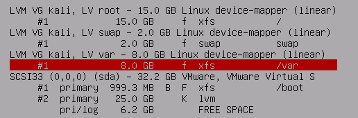

# Install

## Pre:
**Software**
  1. VMware or Virtual Box
  * Kali image
    [URL](https://www.kali.org/downloads/)

## 启动方式
1. 虚拟机 vmware
* Live cd http://www.yyxt.com/a/jpjc/2269.html (软碟通刻录...)
* usb存储设备 Universal-USB-Installer-1.9.3.7 (u盘启动)

## 安装虚拟机
1. New Machines (Ubuntu)
* Set Hardware (Help your self)

* Power On ---> Install (Install or Graphical install)
* Set Language (English - English)
* Set Loaction (Hong Kong)
* Set keymap (American English)

* Set hostname (gan64.cn)
* Set Root Passwd

* Partition disks
思路
1. 创建一个普通分区  大小1G 挂在/boot分区 设置为可引导
* 创建一个大的分区，修改格式类型位LVM
* 编辑上面创建的LVM分区  ---> Configure th Logical Volume Manager
* 在LVM中创建三个分区 分别用于挂载  根目录 交换分区 变量分区->var
详细分区如下：

